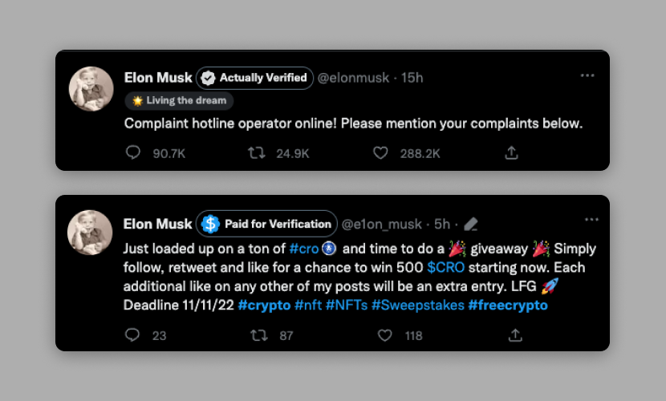
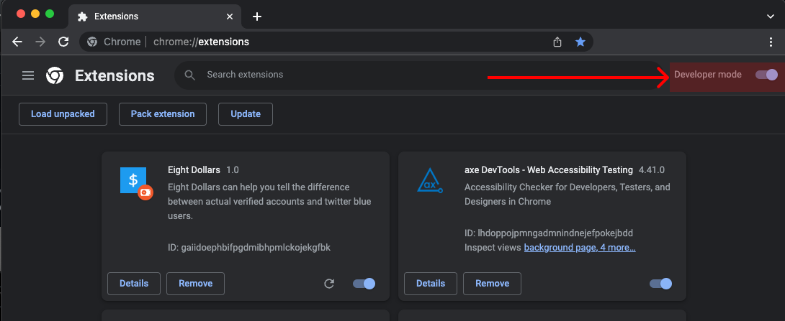
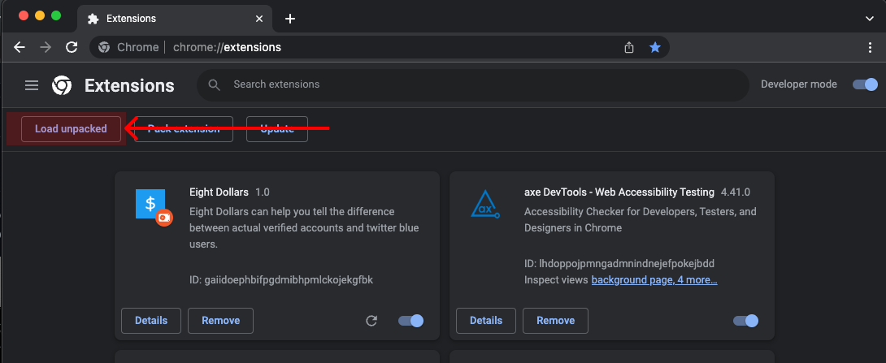
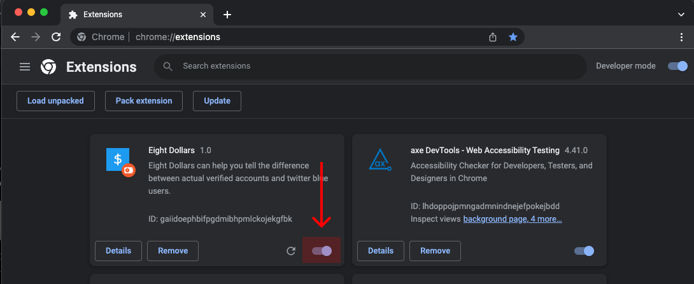

# eight-dollars

eight-dollars can help you tell the difference between actual verified accounts and twitter blue users. Just install the extension and see the difference. Made by [Will Seagar](https://twitter.com/willseagar) and [Walter Lim](https://twitter.com/iWaltzAround)

## How to install

> (Currenting pending approval to Chrome Web Store, installing as a developer extension is a temporary measure until its approved)

1. Open Google Chrome and visit `chrome://extensions`

2. Enable Developer Mode by clicking on the `Developer mode` toggle

3. [Download the extension here](https://github.com/wseagar/eight-dollars/releases/download/v1.1/eight-dollars-v1.1.zip)

4. Unzip the folder

5. Click on the `Load Unpacked` button and select the folder you just downloaded

6. Check that the extension is enabled, and you're good to go! (You can also disable Developer Mode mode)

